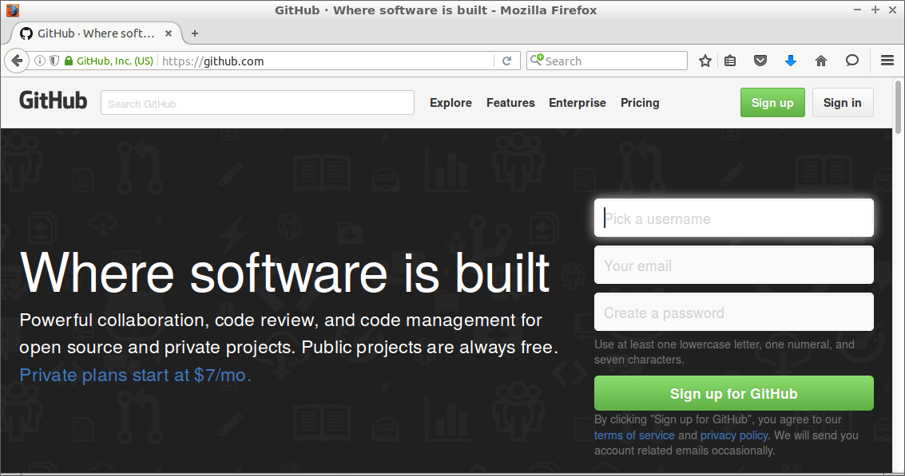
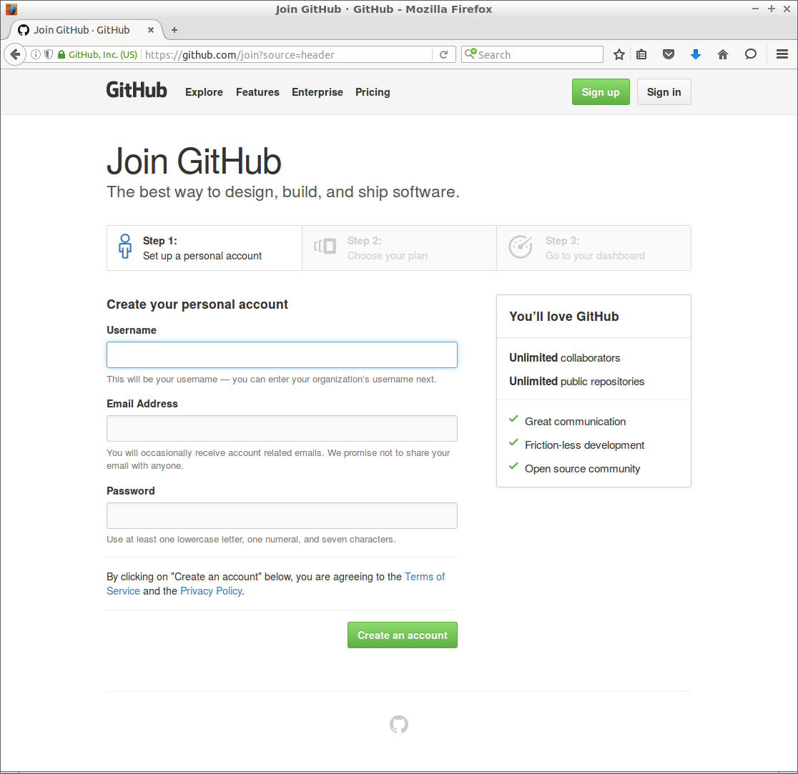
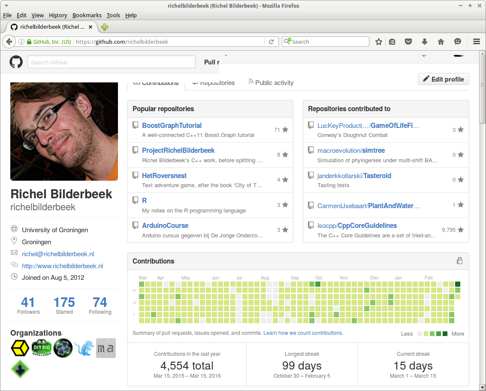

# Setting up the basic build

The basic build is more than just a collection of files. It needs to be set up. This chapter shows how to do so.

 * Create a GitHub online
 * Bring the git repository to your local computer
 * Create a Qt Creator project
 * Create the build bash scripts

## Create a GitHub online

### What is GitHub?

GitHub is a site that creates websites around projects. It is said to host these projects.
Each project contains at least one, but usually multiple files. 
These files can be put on your own hard disc, USB stick, or other storage devices. 
They could also be put at a central place, which is called a repository, so potentially others can also access these. 
GitHub is such a file repository. GitHub also keeps track of the history of the project, 
which is also called version control. GitHub uses git as a version control software. 
In short: GitHub hosts git repositories.



The URL from the GitHub homepage is https://github.com

### Register

Before you can create a new repository, you must register. Registration is free for open source projects, with an unlimitedthe maximum I have observed is a person that has 350 repositories amount of public repositories.

From the GitHub homepage, https://github.com (see figure [fig:GitHub-homepage]), click the top right button labeled 'Sign up'. This will take you to the 'Join GitHub' page (see figure [fig:GitHub-join]). 



Filling this in should be as easy. After filling this in, you are taken to your GitHub profile page.

### Creating a repositoryGitHub, creating a repository

From your GitHub profile page (figure [fig:GitHub-profile]), click on the plus ('Create new ...') at the top right, then click 'New repository' (figure [fig:GitHub-create-repository]).



Do check 'Initialize this repository with a README', add a .gitignore with 'C++' and add a licence like 'GPL 3.0'.

You have now created your own online version controlled repository!

## Bring the git repository to your local computer

### What is git?


`git` is a version control system. It allows you keep a history of a file its content in time. 
It is the more convenient alternative of making copies before each modification.

### Using git

Go to the terminal and type the following line to download your repository:

```
git clone https://github.com/[your_name]/[your_repository]
```

Replace '[your_name]' and '[your_repository]' by your GitHub username and the repository name. A new folder called '[your_repository]' is created where you should work in. For example, to download this tutorial its repository to a folder called 'travis_cpp_tutorial':

```
git clone https://github.com/richelbilderbeek/travis_cpp_tutorial
```

## Create a Qt Creator project

### What is Qt Creator?


Qt Creator is a C++ IDE

### Creating a new project

Project will have some defaults: GCC.

### What is a Qt Creator project file?

A Qt Creator project file contains the information how a Qt Creator project must be built. It commonly has the .pro.pro file extension.

### What is qmake?

qmake is a tool to create makefiles.

Two upper circles: '.pro' -> 'Makefile'

### What is make?

make is a tool that reads a makefile and creates an executable

### What is GCC?


GCC, the GNU Compiler Collection, is a collection of compilers, among other, the C++ compiler called g++.

### What is g++?

g++ is the C++ compiler that is part of the GCC.

### What is C++98?

C++98 is the first C++ standard in 1998.

### What is the STL?

The STL, the Standard Template Library, is the C++ standard library.

## Create the build bash scripts

### What is bash?

'bash' is a shell scripting language
